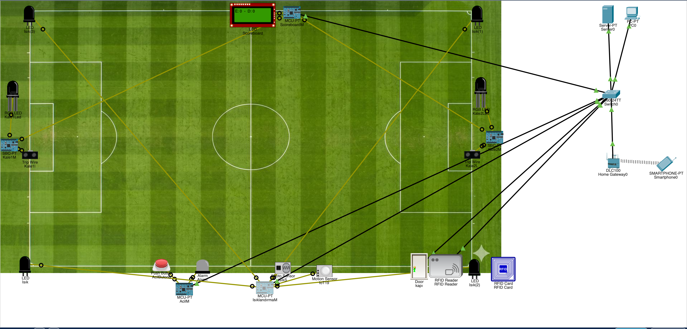
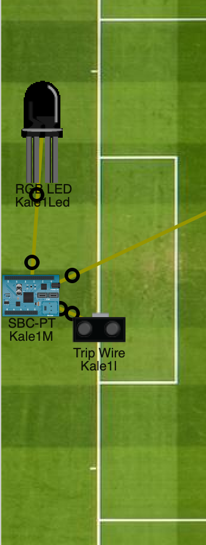
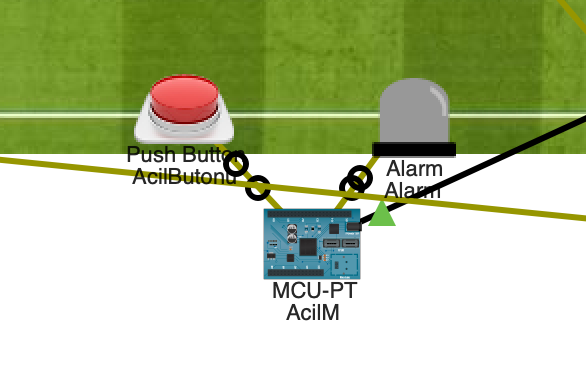
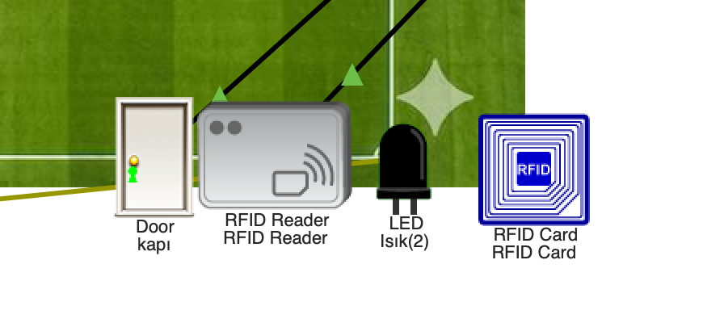
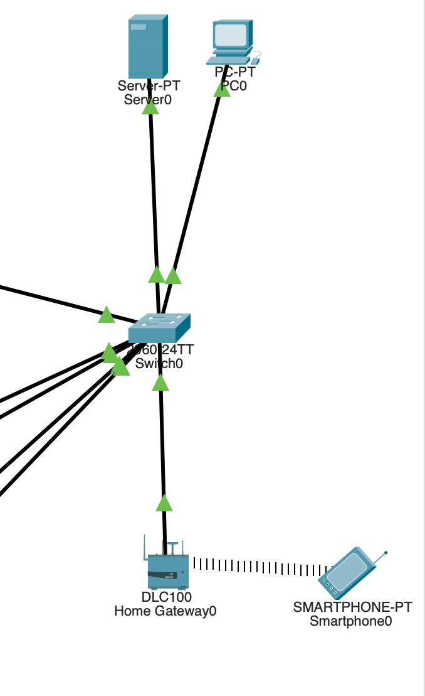

# 🏟️ Smart Stadium IoT & Network Simulation

## 🚀 Overview
This project is a comprehensive **Internet of Things (IoT) and Networking simulation** designed within **Cisco Packet Tracer**. It demonstrates the integration of smart sensors, microcontrollers (MCU/SBC), and centralized networking to automate and manage a modern stadium infrastructure. The hardware logic is programmed using Python, allowing seamless communication between physical sensors and a centralized IoT Smartphone application.

## ✨ Core Features & Modules

### ⚽ 1. Automated Goal Detection & Scoreboard
Utilizes a tripwire sensor on the goal line. When the ball crosses the line, the MCU processes the analog signal, triggers visual LED feedback, and communicates with the central LCD Scoreboard to update the score dynamically.
* **Hardware:** Tripwire Sensor, MCU, LCD Screen, RGB LEDs.
* **Code:** `goal_line_sensor.py`, `scoreboard.py`

### 💡 2. Smart Environmental Lighting
An energy-efficient lighting system that responds to environmental conditions. It combines light sensors (detecting night/day) and motion sensors (detecting player presence). It also includes a non-blocking delay architecture to allow instant manual overrides via the IoT mobile app.
* **Hardware:** Light Sensor, Motion Sensor, SBC, Stadium LED Arrays.
* **Code:** `smart_lightling.py`

### 🚨 3. Emergency Alarm & Security
A synchronized emergency protocol. A physical push-button on the field can trigger the stadium-wide siren and strobe lights. This physical state is bi-directionally synced with the central IoT app, allowing remote activation or deactivation by security personnel.
* **Hardware:** Push Button, MCU, Siren/Alarm.
* **Code:** `emergency_alarm.py`

### 🚪 4. RFID Access Control (Smart Door)
Secure access management for restricted areas (e.g., locker rooms or server rooms) utilizing RFID card readers to authenticate personnel and unlock smart doors automatically.

## 🌐 Network Topology
The system is built on a robust local network architecture. All IoT devices and microcontrollers are connected through a central Switch, routed via a Home Gateway, and managed by a dedicated local Server. This ensures low-latency communication between the field sensors and the remote smartphone controller.

## 🛠️ Tech Stack
- **Simulation Environment:** Cisco Packet Tracer
- **Hardware Programming:** Python (Packet Tracer specific GPIO libraries)
- **Networking:** LAN, IoT Gateway, Switch Configuration, Server Management
- **IoT Protocols:** Bi-directional state reporting and remote control

## ⚙️ How to Run the Simulation
1. Clone this repository to your local machine.
2. Ensure you have **Cisco Packet Tracer** installed.
3. Open the `Smart-Atadium-Project.pkt` file.
4. Open the Smartphone device in the simulation, navigate to the IoT Monitor, and interact with the stadium systems in real-time. You can also view the individual Python logic inside the SBC/MCU programming tabs.
